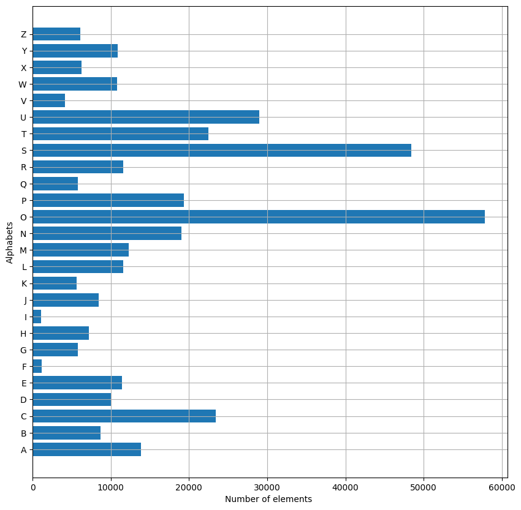
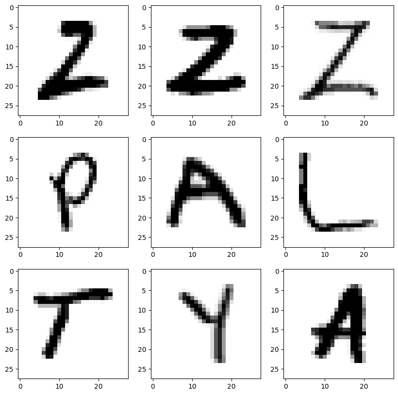
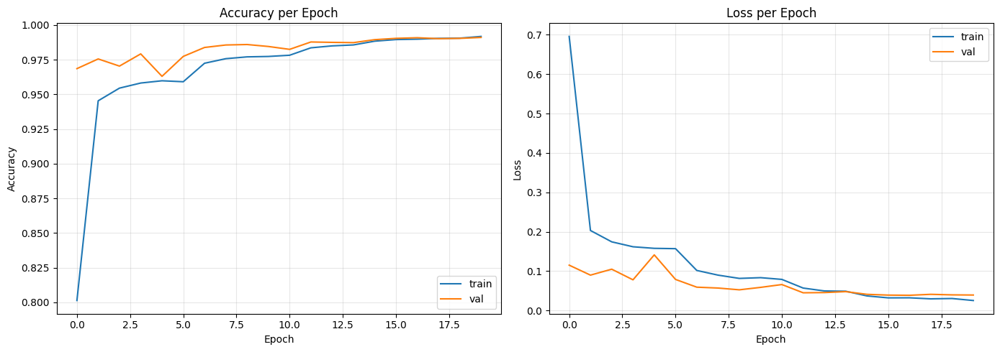
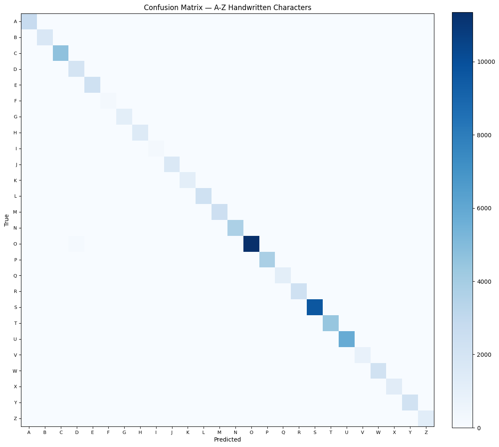
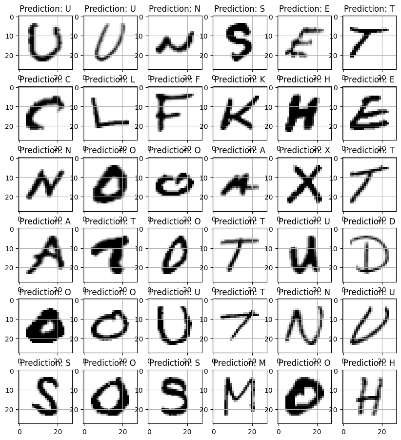

# Handwritten Character Recognition (CNN Classifier)

A CNN-based classifier for recognizing handwritten uppercase letters (A–Z), trained on the [A-Z Handwritten Alphabets](https://www.kaggle.com/datasets/sachinpatel21/az-handwritten-alphabets-in-csv-format) dataset from Kaggle.

## Overview

This is single-character image classification — given one 28×28 grayscale image of a handwritten letter, predict which of the 26 letters it is. It's a simpler, complementary task to sequence-based text recognition (see [`text-recognition-crnn-ctc`](https://github.com/arielshakaramiro/text-recognition-crnn-ctc)): no LSTM, no CTC loss, just a CNN classifier over single-character crops.

## Dataset

[A-Z Handwritten Alphabets in CSV format](https://www.kaggle.com/datasets/sachinpatel21/az-handwritten-alphabets-in-csv-format) — ~370K labeled 28×28 grayscale images of handwritten uppercase letters, downloaded via `kagglehub`.



> Classes are notably imbalanced — `O` and `S` have tens of thousands of samples while `F` and `I` have roughly 1,000. This is addressed during training with class weighting (see below), and the per-class results further down confirm it actually worked rather than just assuming it did.



## Architecture

A small CNN: 3 convolutional blocks (Conv2D + MaxPool) feeding into dense layers (with `Dropout(0.3)` for regularization) and a 26-way softmax output. Compiled with Adam (lr=1e-3) and categorical cross-entropy.

Training uses:
- **Class weighting** (`sklearn.utils.class_weight.compute_class_weight`) so errors on underrepresented letters count more during training
- **`EarlyStopping`** (monitor `val_accuracy`, patience 4, restores best weights) and **`ReduceLROnPlateau`** (monitor `val_loss`, halves the learning rate on plateau) instead of a fixed epoch count with no supervision
- A stratified `train_test_split` (`stratify=y, random_state=42`) so the train/test split preserves class proportions and the split is reproducible

## Results (verified — actual Colab run)

| Metric | Value |
|---|---|
| Best validation accuracy | 99.10% (epoch 20) |
| Best validation loss (same epoch) | 0.0391 |
| Training accuracy (same epoch) | 99.18% |
| Training loss (same epoch) | 0.0251 |
| Epochs trained | 20 (EarlyStopping patience of 4 was not triggered — accuracy was still improving) |



The combination of class weighting, dropout, and LR scheduling produced a strong, well-generalizing result rather than just a model that ran for more epochs without direction.

## Evaluation: Per-Class Performance

The number this repo previously couldn't back up — whether class weighting actually helped the underrepresented letters — is now measured directly with a full `classification_report` and confusion matrix on the test set:

| Letter | Support | Precision | Recall | F1 |
|---|---|---|---|---|
| `F` (minority) | 233 | 0.983 | 0.991 | 0.987 |
| `I` (minority) | 224 | 0.978 | 0.991 | 0.984 |
| `D` (lowest precision) | 2,027 | 0.916 | 0.990 | 0.951 |
| `O` (majority) | 11,565 | 0.998 | 0.981 | 0.990 |
| `S` (majority) | 9,684 | 0.999 | 0.994 | 0.996 |

Macro-average F1 (0.989) and weighted-average F1 (0.991) are close to each other, which is a good sign — it means performance isn't being propped up by the majority classes while minority classes lag behind. `F` and `I` (the two most underrepresented letters) land in a similar F1 range to `O` and `S` (the two most represented), which is the concrete result class weighting was meant to produce.

Interestingly, `D` — not one of the smaller classes — has the *lowest* precision in the whole report (0.916), lower than either minority letter. The confusion matrix shows why: a number of `O` samples (a much larger class) get misclassified as `D`, dragging down `D`'s precision even though `D`'s own recall is fine. This isn't a class-imbalance story — it's a specific shape confusion between two letters that class weighting doesn't address.



Qualitative check on a batch of test images — predicted labels overlaid on each:



> **Note on scope:** the test set still comes from the same dataset distribution as training (same source, same collection process). This doesn't measure how the model handles handwriting styles, scanners, or preprocessing meaningfully different from this dataset's — that would need a genuinely external test set, which wasn't part of this run.

## Setup notes

- **Kaggle credentials:** the notebook first checks Colab Secrets for `KAGGLE_USERNAME` / `KAGGLE_KEY`; if not set, it prompts for manual input. Get these from your Kaggle account → Settings → API → Create New Token.
- **Model persistence:** the notebook mounts Google Drive and saves the trained model (`model_hand.h5`) to `/content/drive/MyDrive/handwritten-character-recognition/`.

## How to run

1. Open `notebooks/handwritten_character_recognition.ipynb` in Google Colab
2. Run all cells — you'll be prompted for Kaggle credentials (if not in Colab Secrets) and Drive access

## Repo structure

```
.
├── notebooks/
│   └── handwritten_character_recognition.ipynb
├── images/
│   ├── class_distribution.png
│   ├── sample_dataset.png
│   ├── training_curves.png
│   ├── confusion_matrix.png
│   └── prediction_grid.png
├── LICENSE
└── README.md
```

## License

MIT — see [LICENSE](LICENSE).
